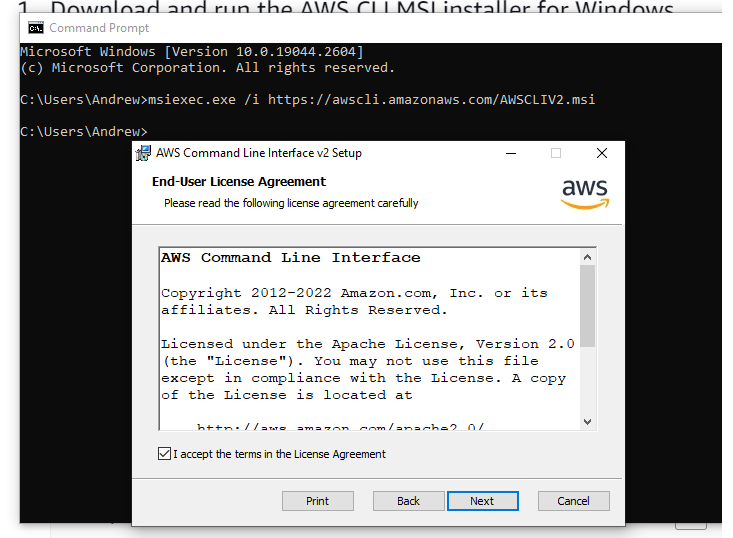
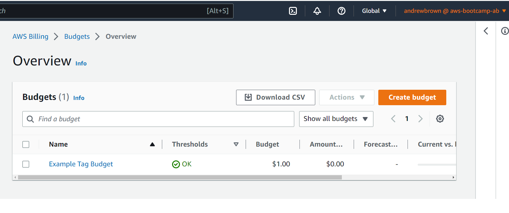
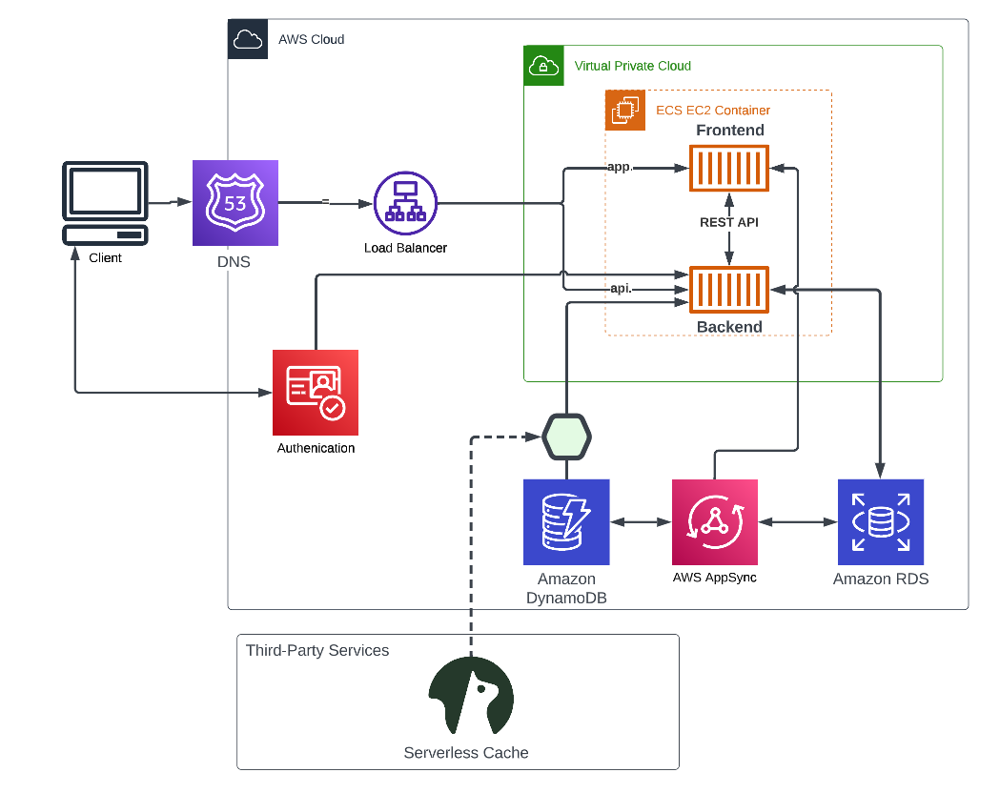

# Week 0 — Billing and Architecture

## Required Homework/Tasks

### Install and Verify AWS CLI 

I was not able to use Gitpod or Github Codespaces due to browser issues.
So I decided to use a local enviroment.

In order to prove that I am able to use the AWS CLI.
I am providing the instructions I used for my configuration of my local machine on windows.

I did the following steps to install AWS CLI.

I installed the AWS CLI for Windows 10 via command in **Command Prompt**:

I followed the instructions on the [AWS CLI Install Documentation Page](https://docs.aws.amazon.com/cli/latest/userguide/getting-started-install.html)



```
msiexec.exe /i https://awscli.amazonaws.com/AWSCLIV2.msi
```

I attempted to run the command by typing in `aws` but I recieved an error

```
C:\Users\Andrew>aws
'aws' is not recognized as an internal or external command,
operable program or batch file.
```

I was able to resolve the error by closing command prompt, and opening it again.


### Create a Budget

I created my own Budget for $1 because I cannot afford any kind of spend.
I did not create a second Budget because I was concerned of budget spending going over the 2 budget free limit.

 

### Recreate Logical Architectural Deisgn



[Lucid Charts Share Link](https://lucid.app/lucidchart/c6d54586-0334-44ab-95cb-d11772edcace/edit?viewport_loc=-259%2C144%2C2219%2C1161%2C0_0&invitationId=inv_19e0767b-5aa5-49ec-bccd-f220b9163d2f
)

## Example of Referncing a file in the codebase

Example of me of referencing a file in my repo
[week-1-again/aws/json/alarm-config.jso](https://github.com/omenking/aws-bootcamp-cruddur-2023/blob/week-1-again/aws/json/alarm-config.json)

## List Example

- This
- Is 
- A
- List

1. This
2. Is
3. A 
3. Ordered 
4. List

## Table Example

| My | Cool | Table |
| --- | --- | ---|
| Hello | World | ! |

## Code Example

```json
{
  "AlarmName": "DailyEstimatedCharges",
  "AlarmDescription": "This alarm would be triggered if the daily estimated charges exceeds 1$",
  "ActionsEnabled": true,
  "AlarmActions": [
      "arn:aws:sns:ca-central-1:***REMOVED***:billing-alarm"
  ],
  "EvaluationPeriods": 1,
  "DatapointsToAlarm": 1,
  "Threshold": 1,
  "ComparisonOperator": "GreaterThanOrEqualToThreshold",
  "TreatMissingData": "breaching",
  "Metrics": [{
      "Id": "m1",
      "MetricStat": {
          "Metric": {
              "Namespace": "AWS/Billing",
              "MetricName": "EstimatedCharges",
              "Dimensions": [{
                  "Name": "Currency",
                  "Value": "USD"
              }]
          },
          "Period": 86400,
          "Stat": "Maximum"
      },
      "ReturnData": false
  },
  {
      "Id": "e1",
      "Expression": "IF(RATE(m1)>0,RATE(m1)*86400,0)",
      "Label": "DailyEstimatedCharges",
      "ReturnData": true
  }]
}
```
