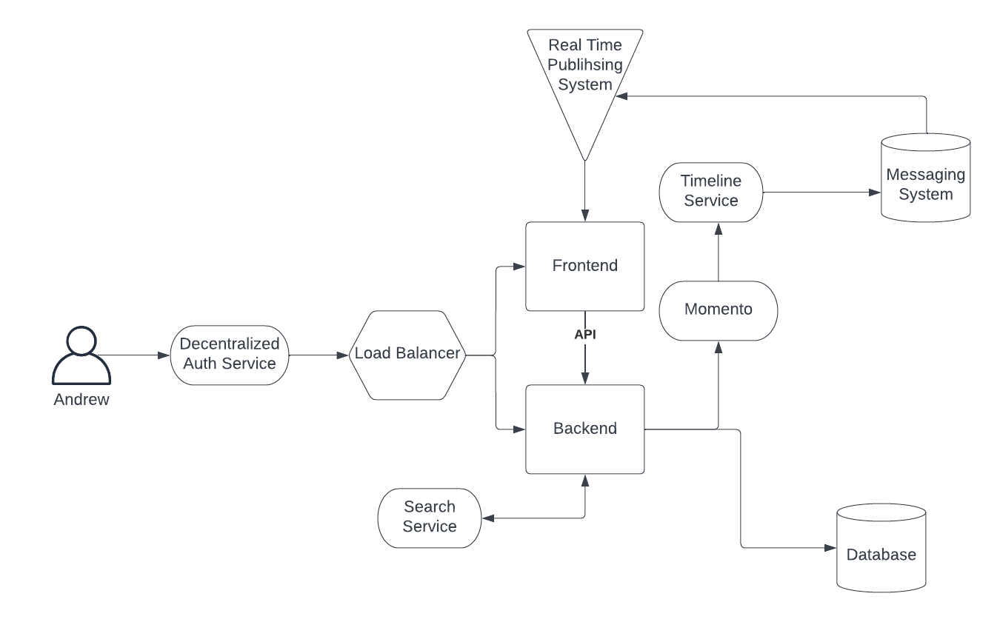
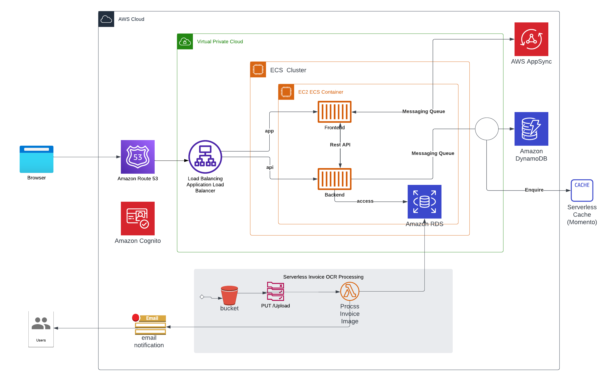

# Week 0 — Billing and Architecture
In Week 0 of AWS bootcamp 2003, I tried to create one conceptual diagram and one logical diagram using Lucid Chart.

## Conceptual Diagram

https://lucid.app/lucidchart/3f9fdf2d-54d1-468c-bd7d-5545c18c2e0b/edit?invitationId=inv_52b564d9-2f5a-4c2d-98aa-1573c9cccf07&page=0_0#

## Logical Diagram

