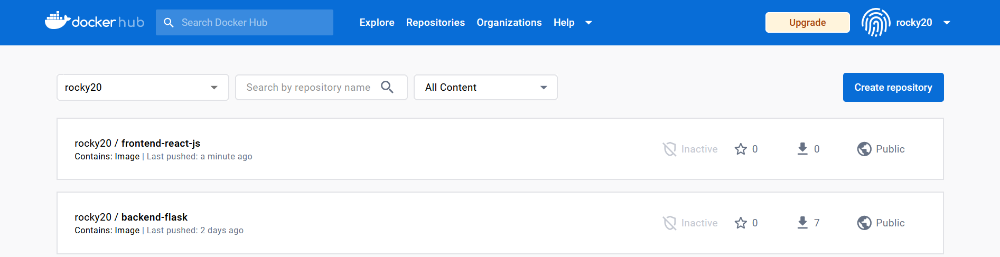

# Week 1 — App Containerization
<br />

# New topics learned
 - Vulnerability Scanning Tools (Snyk)
 - Container Security Components include:-
     - Docker & Host Configuration
     - Securing Images
     - Secret Management
     - Application Security
     - Data Security
     - Monitoring Containers
     - Compliance Framework
 - Follow Security Best Practices [TrendMicro](https://www.trendmicro.com/en_us/devops/22/b/container-security-best-practices.html)
 - [Rails Service Objects: A Comprehensive Guide](https://www.toptal.com/ruby-on-rails/rails-service-objects-tutorial)
# Tasks completed
 -  First time using Snyk to scan for vulnerabilities
 
    
   
 -  Snyk extension on Docker Desktop

   
   
 -  Vulnerabilities report (aws-bootcamp-cruddur-2023)

   

 -  Critical Vulnerabilities Fixed (e.g., Upgrade node:16.18-alpine to node:16.19.1-alpine)
 
    

 -  Running Backend Locally
   ```
   cd backend-flask
   export FRONTEND_URL="*"
   export BACKEND_URL="*"
   pip install -r requirements.txt
   python3 -m flask run --host=0.0.0.0 --port=4567
   ```
   
   In cURL, we can use or pipe the json_pp to pretty print the JSON output.

   ```
   curl http://127.0.0.1:4567/api/activities/home | json_pp
   ```
   
   
   
   
   
 -  Run Frontend Locally
   ```
   cd frontend-react-js
   npm i
   npm start
   ```

   
   
-  Create two Dockerfile(s) for Frontend and Backend then build the images with the following commands:-
   
   ```
   docker build -t  backend-flask:latest ./backend-flask
   docker run --rm -p 4567:4567 -it -e FRONTEND_URL='' -e BACKEND_URL='' backend-flask
   
   docker build -t frontend-react-js:1.0 ./frontend-react-js
   docker run --rm -p 3000:3000 -it -e FRONTEND_URL='' -e BACKEND_URL='' frontend-react-js:1.0
   
   docker login -u="${DOCKER_USERNAME}" -p="${DOCKER_PASSWORD}"
   
   docker tag backend-flask rocky20/backend-flask
   docker push rocky20/backend-flask
   
   docker tag frontend-react-js:1.0 rocky20/frontend-react-js:latest
   docker push rocky20/frontend-react-js:latest
   ```
   
-  Backend and Frontend images uploaded to dockerhub 
   [Backend Link](https://hub.docker.com/r/rocky20/backend-flask), [Frontend Link](https://hub.docker.com/r/rocky20/frontend-react-js)

   
- Create a Docker Compose file to run both images simultaneously
  ```
    version: "3.8"
    services:
      backend-flask:
        environment:
          FRONTEND_URL: "https://3000-${GITPOD_WORKSPACE_ID}.${GITPOD_WORKSPACE_CLUSTER_HOST}"
          BACKEND_URL: "https://4567-${GITPOD_WORKSPACE_ID}.${GITPOD_WORKSPACE_CLUSTER_HOST}"
        build: ./backend-flask
        ports:
          - "4567:4567"
        volumes:
          - ./backend-flask:/backend-flask
      frontend-react-js:
        environment:
          REACT_APP_BACKEND_URL: "https://4567-${GITPOD_WORKSPACE_ID}.${GITPOD_WORKSPACE_CLUSTER_HOST}"
        build: ./frontend-react-js
        ports:
          - "3000:3000"
        volumes:
          - ./frontend-react-js:/frontend-react-js

      dynamodb-local:
        user: root
        command: "-jar DynamoDBLocal.jar -sharedDb -dbPath ./data"
        image: "amazon/dynamodb-local:latest"
        container_name: dynamodb-local
        ports:
          - "8000:8000"
        volumes:
          - "./docker/dynamodb:/home/dynamodblocal/data"
        working_dir: /home/dynamodblocal

      db:
        image: postgres:13-alpine
        restart: always
        environment:
          - POSTGRES_USER=postgres
          - POSTGRES_PASSWORD=password
        ports:
          - '5432:5432'
        volumes:
          - db:/var/lib/postgresql/data

    # the name flag is a hack to change the default prepend folder
    # name when outputting the image names
    networks:
      internal-network:
        driver: bridge
        name: cruddur

    volumes:
      db:
        driver: local
    ```
   

- Set up DynamoDB

  ```
   # Create DynamoDB Table
   aws dynamodb create-table \
     --endpoint-url http://localhost:8000 \
     --table-name Music \
     --attribute-definitions \
         AttributeName=Artist,AttributeType=S \
         AttributeName=SongTitle,AttributeType=S \
     --key-schema AttributeName=Artist,KeyType=HASH AttributeName=SongTitle,KeyType=RANGE \
     --provisioned-throughput ReadCapacityUnits=1,WriteCapacityUnits=1 \
     --table-class STANDARD
    
    
   # Create Item
   aws dynamodb put-item \
    --endpoint-url http://localhost:8000 \
    --table-name Music \
    --item \
        '{"Artist": {"S": "No One You Know"}, "SongTitle": {"S": "Call Me Today"}, "AlbumTitle": {"S": "Somewhat Famous"}}' \
    --return-consumed-capacity TOTAL
    
   # List Items
   aws dynamodb list-tables --endpoint-url http://localhost:8000
   
   # Get Records
   aws dynamodb scan --table-name Music --query "Items" --endpoint-url http://localhost:8000
  ```
  
-  Run PostgreSQL
   ```
   psql -h localhost -U postgres
   docker exec -it aws-bootcamp-cruddur-2023-db-1 psql -U postgres
   ```
   
   
