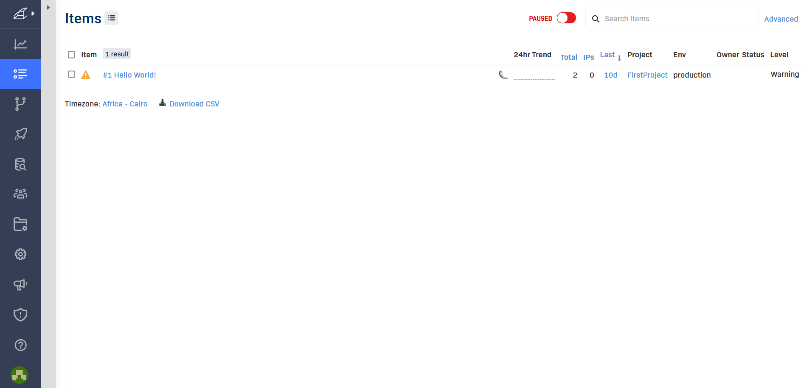

# Week 2 — Distributed Tracing

<br />

# New topics learned

- [Observability vs Monitoring vs Telemetry: Understanding the Key Differences](https://cribl.io/blog/observability-vs-monitoring-vs-telemetry/)

  

# Tasks completed

- Instrument the backend app with Honeycomb Open Telemetry (OTEL)

  

  

- Implement AWS Xray

  Add the following package to backend-flask/requirements.txt

  ```
   aws-xray-sdk
  ```

  Edit [docker-compose.yml](../docker-compose.yml) and Add:

  ```
  version: "3.8"
  services:
      backend-flask:
          environment:
              ...
              AWS_XRAY_URL: "*4567-${GITPOD_WORKSPACE_ID}.${GITPOD_WORKSPACE_CLUSTER_HOST}*"
              AWS_XRAY_DAEMON_ADDRESS: "xray-daemon:2000"

      ...
      xray-daemon:
          image: "amazon/aws-xray-daemon"
          environment:
              AWS_ACCESS_KEY_ID: "${AWS_ACCESS_KEY_ID}"
              AWS_SECRET_ACCESS_KEY: "${AWS_SECRET_ACCESS_KEY}"
              AWS_REGION: "us-east-1"
          command:
              - "xray -o -b xray-daemon:2000"
          ports:
              - 2000:2000/udp
  ```

  Then I ran the following command to group Xray traces:

  ```
  $ aws xray create-group \
  --group-name "Cruddur" \
  --filter-expression "service(\"backend-flask\")"
  ```

  Created a sampling rule for Xray service 

  ```
  {
  "SamplingRule": {
      "RuleName": "Cruddur",
      "ResourceARN": "*",
      "Priority": 9000,
      "FixedRate": 0.1,
      "ReservoirSize": 5,
      "ServiceName": "backend-flask",
      "ServiceType": "*",
      "Host": "*",
      "HTTPMethod": "*",
      "URLPath": "*",
      "Version": 1
      }
  }
  ```

  Run the following command in the terminal

  ```
  $ aws xray create-sampling-rule --cli-input-json file://aws/json/xray.json
  ```

  

  Add the following to 

  ```
  ...
  ...

  # X_RAY
  from aws_xray_sdk.core import xray_recorder
  from aws_xray_sdk.ext.flask.middleware import XRayMiddleware

  xray_url = os.getenv("AWS_XRAY_URL")
  #xray_recorder.configure(service='backend-flask', dynamic_naming=xray_url)
  xray_recorder.configure(service='backend-flask') # To make sure that all traces can be grouped under the created Cruudr group

  ......
  ......

  app = Flask(__name__)

  #XRAY
  XRayMiddleware(app, xray_recorder)
  ```

- Xray Traces in the AWS Console

  
  
  

  Raw Output of the above screenshot:

  ```
  {
      "Id": "1-64199bf4-6998a8a7b2614c8a1fd94430",
      "Duration": 0.002,
      "LimitExceeded": false,
      "Segments": [
          {
              "Id": "7737f478c76cb8c4",
              "Document": {
                  "id": "7737f478c76cb8c4",
                  "name": "backend-flask",
                  "start_time": 1679399924.0736885,
                  "trace_id": "1-64199bf4-6998a8a7b2614c8a1fd94430",
                  "end_time": 1679399924.075747,
                  "in_progress": false,
                  "http": {
                      "request": {
                          "url": "http://4567-peter2220-awsbootcampcr-x321f6gg5yh.ws-eu90.gitpod.io/api/activities/home",
                          "method": "GET",
                          "user_agent": "Mozilla/5.0 (Windows NT 10.0; Win64; x64; rv:109.0) Gecko/20100101 Firefox/111.0",
                          "client_ip": "197.39.79.159",
                          "x_forwarded_for": true
                      },
                      "response": {
                          "status": 200,
                          "content_length": 1240
                      }
                  },
                  "aws": {
                      "xray": {
                          "sampling_rule_name": "Cruddur",
                          "sdk_version": "2.11.0",
                          "sdk": "X-Ray for Python"
                      }
                  },
                  "service": {
                      "runtime": "CPython",
                      "runtime_version": "3.11.2"
                  },
                  "subsegments": [
                      {
                          "id": "8d6ba9f5ea97429b",
                          "name": "activities_home",
                          "start_time": 1679399924.0746317,
                          "end_time": 1679399924.0752327,
                          "in_progress": false,
                          "namespace": "local"
                      }
                  ]
              }
          }
      ]
  }
  ```

- CloudWatch Logs

  Add the following package to 

  ```
   watchtower
  ```

  Update [docker-compose.yml](../docker-compose.yml)

  ```
  version: "3.8"
  services:
      backend-flask:
          environment:
              ...
              AWS_DEFAULT_REGION: "${AWS_DEFAULT_REGION}"
              AWS_ACCESS_KEY_ID: "${AWS_ACCESS_KEY_ID}"
              AWS_SECRET_ACCESS_KEY: "${AWS_SECRET_ACCESS_KEY}"

   ...
  ```

  Add the following to [app.py](../backend-flask/app.py):

  ```python
  ...
  #Cloudwatch Logs
  import watchtower
  import logging
  from time import strftime
  ...

  # Configuring Logger to Use CloudWatch
  LOGGER = logging.getLogger(__name__)
  LOGGER.setLevel(logging.DEBUG)
  console_handler = logging.StreamHandler()
  cw_handler = watchtower.CloudWatchLogHandler(log_group='cruddur')
  LOGGER.addHandler(console_handler)
  LOGGER.addHandler(cw_handler)
  LOGGER.info("Test Message")

  app = Flask(__name__)

  ...

  @app.after_request
  def after_request(response):
      timestamp = strftime('[%Y-%b-%d %H:%M]')
      LOGGER.error('%s %s %s %s %s %s', timestamp, request.remote_addr, request.method, request.scheme, request.full_path, response.status)
      return response
  ```

  

- Cloud Watch Log groups

  

  

- Implement Logging with Rollbar
  Add ROLLBAR_ACCESS_TOKEN environment variable to gitpod.

  Add the following package to [requirements.txt](../backend-flask/requirements.txt)

  ```
   blinker
   rollbar
  ```

  Add the following to [docker-compose.yml](../docker-compose.yml):

  ```yaml
  version: "3.8"
  services:
  backend-flask:
      environment:
      ...

      ROLLBAR_ACCESS_TOKEN: "${ROLLBAR_ACCESS_TOKEN}"
      ...
  ```

  Update [app.py](../backend-flask/app.py):

  ```python
   ...
   #Rollbar
   import rollbar
   import rollbar.contrib.flask
   from flask import got_request_exception

   ...

   app = Flask(__name__)

   ...

   # Rollbar Intialize
   rollbar_access_token = os.getenv('ROLLBAR_ACCESS_TOKEN')
   @app.before_first_request
   def init_rollbar():
       """init rollbar module"""
       rollbar.init(
           # access token
           rollbar_access_token,
           # environment name
           'production',
           # server root directory, makes tracebacks prettier
           root=os.path.dirname(os.path.realpath(__file__)),
           # flask already sets up logging
           allow_logging_basic_config=False)

       # send exceptions from `app` to rollbar, using flask's signal system.
       got_request_exception.connect(rollbar.contrib.flask.report_exception, app)

   @app.route('/rollbar/test')
   def rollbar_test():
       rollbar.report_message('Hello World!', 'warning')
       return "Hello World!"
  ```

  Docker Compose Up, Inspect Rollbar Logs running at running the endpoint /rollbar/test:

  

- Instrument Frontend service with Honeycomb
  After trying different ways to do this part on my own, I found an article on [dev.to](https://dev.to/djaballah_mi/aws-free-cloud-bootcamp-instrumenting-the-frontend-app-with-honeycomb-4p3o) that helped me complete this step.
  We can directly implement Instrument the frontend service but from security prespective It is a bad practice to set up the ACCESS_TOKEN in the frontend code.

  Implement a proxy to collect traces from the frontend through an Endpoint

  Update [requirements.txt](../backend-flask/requirements.txt)

  ```txt
  # Requests Library - POST requests to honeycomb traces endpoint
  requests
  ```

  Update [docker-compose.yml](../docker-compose.yml) to make requests to the Honeycomb traces endpoint

  ```yaml
  ---
  HONEYCOMB_API_KEY: "${HONEYCOMB_API_KEY}"
  HONEYCOMB_TRACES_API: "https://api.honeycomb.io/v1/traces"
  ```

  Implement an endpoint /honeycomb/traces to receive spans from the frontend and send it to Honeycomb
  Update [backend-flask/app.py](../backend-flask/app.py)

  ```python
  ...

  # Requests Library - POST requests to honeycomb traces endpoint
  import requests

  ...
  ...
  """
  Implement Endpoint to receive spans from the Frontend
  and send it to Honeycomb traces API
  """

  @app.route("/honeycomb/traces", methods=['POST','OPTIONS'])
  @cross_origin(supports_credentials=True)
  def collect_traces():
  otlp_json_exported_from_frontend = request.json
  headers = {
      'Content-Type': 'application/json',
      'x-honeycomb-team': os.getenv('HONEYCOMB_API_KEY'),
  }

  response = requests.post(
      url=os.getenv('HONEYCOMB_TRACES_API'),
      json=otlp_json_exported_from_frontend,
      headers=headers
  )

  return {'success': True}, 200
  ```

  Necessary steps to send traces to the proxy

  ```
  cd /frontend-react-js
  ```

  Install OTEL Packages:

  ```
  npm install --save \
      @opentelemetry/api \
      @opentelemetry/sdk-trace-web \
      @opentelemetry/exporter-trace-otlp-http \
      @opentelemetry/context-zone
  ```

  Create a [frontend-react-js/src/services/tracing.js](../frontend-react-js/src/services/tracing.js) file to send traces to the backend proxy

  ```
  import { OTLPTraceExporter } from '@opentelemetry/exporter-trace-otlp-http';
  import { WebTracerProvider, BatchSpanProcessor } from '@opentelemetry/sdk-trace-web';
  import { ZoneContextManager } from '@opentelemetry/context-zone';
  import { Resource }  from '@opentelemetry/resources';
  import { SemanticResourceAttributes } from '@opentelemetry/semantic-conventions';
  import process from 'process';

  // Configure the open telemetry trace exporter to send traces to the backend proxy.
  const exporter = new OTLPTraceExporter({
  url: `${process.env.REACT_APP_BACKEND_URL}/honeycomb/traces`,
  });

  // Configure the open telemetry web trace provider, and set the service name to `fronted-react-js`
  const provider = new WebTracerProvider({
  resource: new Resource({
      [SemanticResourceAttributes.SERVICE_NAME]: 'fronted-react-js',
  }),
  });

  provider.addSpanProcessor(new BatchSpanProcessor(exporter));

  provider.register({
  contextManager: new ZoneContextManager()
  });

  ```

  Import the tracing.js inside [frontend-react-js/src/index.js](../frontend-react-js/src/index.js)

  ```
  import './services/tracing'
  ```

  Implement a custom trace inside the [frontend-react-js/HomeFeedPage.js](frontend-react-js\src\pages\HomeFeedPage.js)

  ```javascript
  // Import trace from opentelemetry/api
  import { trace } from '@opentelemetry/api';

  ...

  // Initiate a tracer
  const tracer = trace.getTracer();

  ...

  React.useEffect(()=>{
      //prevents double call
      if (dataFetchedRef.current) return;
      dataFetchedRef.current = true;
      // Create three spans for HomeFeedPage, Fetch Home Activities Data, Authentication Check
      tracer.startActiveSpan('HomeFeedPage', (span) => {
      tracer.startActiveSpan('load_data', (span) => {
          span.setAttribute('endpoint', '/api/activities/home');
          loadData();
          span.end()
      })
      tracer.startActiveSpan('check_auth', (span) => {
          span.setAttribute('endpoint', '/api/auth');
          checkAuth();
          span.end()
      })
      span.end()
      })
  }, [])

  ```

  

 Important resources<br />
  [AWS X-Ray daemon (Application Instrumentation = Produce logs, traces)](https://docs.aws.amazon.com/xray/latest/devguide/xray-daemon.html)<br />
  [aws-xray-sdk-python](https://github.com/aws/aws-xray-sdk-python)<br />
  [OpenTelemetry for Python](https://docs.honeycomb.io/getting-data-in/opentelemetry/python/)<br />
  [What Honeycomb.io team is this? Test Honeycomb API Key](http://honeycomb-whoami.glitch.me/)<br />