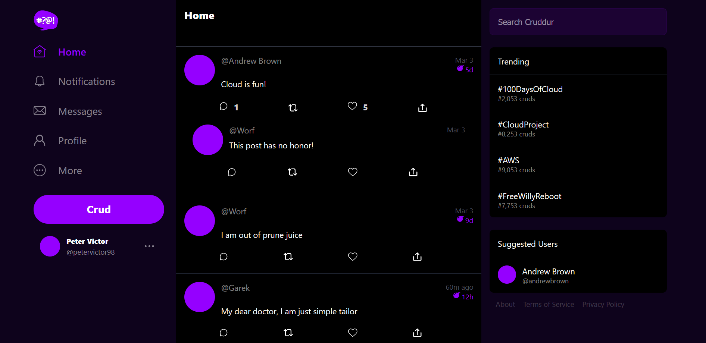

# **Week 3 — Decentralized Authentication**

<br />

# **New topics learned**
-
-
-
# **Tasks completed**

## **Setup Cognito User Pool using the AWS Console**
### **Amazon Cognito User Pool Settings** 
    Cognito user pool sign-in options: Email only
    **No** Multi-factor Authentication (MFA)
    Required attributes (Additional attributes): name, preferred_username
    Email (Email provider): Send email with Cognito
    


### **Setup Environment Variables for Frontend and Enabling Signing in**
### ***Note: AWS Amplify uses Amazon Cognito as the main authentication provider.***

    ```bash
    $ npm i aws-amplify --save
    ```

### **Add the following code to [.gitpod.yml](../.gitpod.yml) to include the node modules:** 
    ```yaml
    - name: npm-init
        init: |
        cd /workspace/aws-bootcamp-cruddur-2023/frontend-react-js
        npm i --save \
            @opentelemetry/api \
            @opentelemetry/sdk-trace-web \
            @opentelemetry/exporter-trace-otlp-http \
            @opentelemetry/instrumentation-document-load \
            @opentelemetry/context-zone \
            aws-amplify
    ```
### **Add AWS Cognito environment variables**

    ```bash
    $ gp env AWS_COGNITO_USER_POOL_CLIENT_ID="**********"
    $ gp env AWS_COGNITO_USER_POOL_ID="**********"
    ```

### **Also, add environment variables to [docker-compose.yml](../docker-compose.yml):**

    ```yaml
    version: "3.8"
    services:
    ...
    
    frontend-react-js:
        environment:
        REACT_APP_BACKEND_URL: "https://4567-${GITPOD_WORKSPACE_ID}.${GITPOD_WORKSPACE_CLUSTER_HOST}"
        REACT_APP_AWS_PROJECT_REGION: "${AWS_DEFAULT_REGION}"
        REACT_APP_AWS_COGNITO_REGION: "${AWS_DEFAULT_REGION}"
        REACT_APP_AWS_USER_POOLS_ID: "${REACT_APP_AWS_USER_POOLS_ID}"
        REACT_APP_CLIENT_ID: "${REACT_APP_CLIENT_ID}"
        build: ./frontend-react-js
        ...

    ```

### **To complete AWS Amplify configuration, add the following [App.js](../frontend-react-js/src/App.js):**
    ```js
    ...

    import { Amplify } from 'aws-amplify';

    ...

    Amplify.configure({
    "AWS_PROJECT_REGION": process.env.REACT_APP_AWS_PROJECT_REGION,
    "aws_cognito_region": process.env.REACT_APP_AWS_COGNITO_REGION,
    "aws_user_pools_id": process.env.REACT_APP_AWS_USER_POOLS_ID,
    "aws_user_pools_web_client_id": process.env.REACT_APP_CLIENT_ID,
    "oauth": {},
    Auth: {
        region: process.env.REACT_APP_AWS_PROJECT_REGION,           // REQUIRED - Amazon Cognito Region
        userPoolId: process.env.REACT_APP_AWS_USER_POOLS_ID,         // OPTIONAL - Amazon Cognito User Pool ID
        userPoolWebClientId: process.env.REACT_APP_CLIENT_ID,   // OPTIONAL - Amazon Cognito Web Client ID (26-char alphanumeric string)
    }
    });

    ...
    ```

### **Customized the HomeFeed page based on authenticated user, import Auth from AWS Amplify, replace checkAuth method in [HomeFeedPage.js](../frontend-react-js/src/pages/HomeFeedPage.js):**

    ```js
    ...

    //AWS Amplify
    import { Auth } from 'aws-amplify';
    ...

    // check if we are authenticated
    const checkAuth = async () => {
    Auth.currentAuthenticatedUser({
        // Optional, By default is false. 
        // If set to true, this call will send a 
        // request to Cognito to get the latest user data
        bypassCache: false 
    })
    .then((user) => {
        console.log('user',user);
        return Auth.currentAuthenticatedUser()
    }).then((cognito_user) => {
        setUser({
            display_name: cognito_user.attributes.name,
            handle: cognito_user.attributes.preferred_username
        })
    })
    .catch((err) => console.log(err));
    };

    ```

### **Modify [SigninPage.js](../frontend-react-js/src/pages/SigninPage.js) to enable signing in with AWS Cognito:**

    ```js

    ...

    //AWS Amplify
    import { Auth } from 'aws-amplify';
    
    ...

    // Replace the *onSubmit* method
    const onsubmit = async (event) => {
     event.preventDefault();

     Auth.signIn(email, password)
       .then(user => {
         localStorage.setItem("access_token", user.signInUserSession.accessToken.jwtToken)
         window.location.href = "/"
       })
       .catch(error => { if (error.code == 'UserNotConfirmedException') {
         window.location.href = "/confirm"
       }
       setErrors(error.message) });

     return false
     
     ```
   

### **Modify [ProfileInfo.js](../frontend-react-js/src/components/ProfileInfo.js) to allow user to Sign-Out:** 

    ```js

    ...
    
    //AWS Amplify
    import { Auth } from 'aws-amplify';

    ...

    const signOut = async () => {
        try {
            await Auth.signOut({ global: true });
            window.location.href = "/"
        } catch (error) {
            console.log('error signing out: ', error);
        }
    }
    ```

### **To change Amazon Cognito User Status (FORCE_CHANGE_PASSWORD) bypass verification:**

    ```bash
    $ aws cognito-idp admin-set-user-password \
      --user-pool-id <your-user-pool-id> \
      --username <username> \
      --password <password> \
      --permanent
    ```
### **User Confirmed in AWS Cognito**


### **Crudder user login**



### **Implement Custom Signup, Confirmation, and Recovery Pages**
### **Modify [SignupPage.js](../frontend-react-js/src/pages/SignupPage.js) by importing Auth from AWS Amplify, edit onsubmit method:**

    ```js

    ...

    //AWS Amplify
    import { Auth } from 'aws-amplify';

    ...

    // Replace the onSubmit method
    const onsubmit = async (event) => {
      event.preventDefault();
      setErrors('')
      try {
          const { user } = await Auth.signUp({
            username: email,
            password: password,
            attributes: {
              name: name,
              email: email,
              preferred_username: username,
            },
            autoSignIn: { // optional - enables auto sign in after user is confirmed
              enabled: true,
            }
          });
          console.log(user);
          window.location.href = `/confirm?email=${email}`
      } catch (error) {
          console.log(error);
          setErrors(error.message)
      }
      return false
    }
    ...

    ```

### **Edit [ConfirmationPage.js](../frontend-react-js/src/pages/ConfirmationPage.js), by importing Auth from AWS Amplify, edit onsubmit and resend_code methods:**

    ```js

    ...
    
    //AWS Amplify
    import { Auth } from 'aws-amplify';

    ...

    // Replace the onsubmit and resend_code methods
    const resend_code = async (event) => {
      setErrors('')
      try {
        await Auth.resendSignUp(email);
        console.log('code resent successfully');
        setCodeSent(true)
      } catch (err) {
        console.log(err)
        if (err.message == 'Username cannot be empty'){
          setErrors("You need to provide an email in order to send Resend Activiation Code")   
        } else if (err.message == "Username/client id combination not found."){
          setErrors("Email is invalid or cannot be found.")   
        }
      }
    }

    const onsubmit = async (event) => {
      event.preventDefault();
      setErrors('')
      try {
        await Auth.confirmSignUp(email, code);
        window.location.href = "/"
      } catch (error) {
        setErrors(error.message)
      }
      return false
    }
    ...

    ```
### **Edit [RecoverPage.js](../frontend-react-js/src/pages/RecoverPage.js), by importing Auth from AWS Amplify, edit onsubmit_send_code and onsubmit_confirm_code methods:**

    ```js

    ...

    import { Auth } from 'aws-amplify';

    ...

    // Replace the onsubmit_send_code and onsubmit_confirm_code methods
    const onsubmit_send_code = async (event) => {
        event.preventDefault();
        setErrors('')
        Auth.forgotPassword(username)
        .then((data) => setFormState('confirm_code') )
        .catch((err) => setErrors(err.message) );
        return false
    }
    
    const onsubmit_confirm_code = async (event) => {
        event.preventDefault();
        setErrors('')
        if (password == passwordAgain){
        Auth.forgotPasswordSubmit(username, code, password)
        .then((data) => setFormState('success'))
        .catch((err) => setErrors(err.message) );
        } else {
        setCognitoErrors('Passwords do not match')
        }
        return false
    }
    ...

    ```