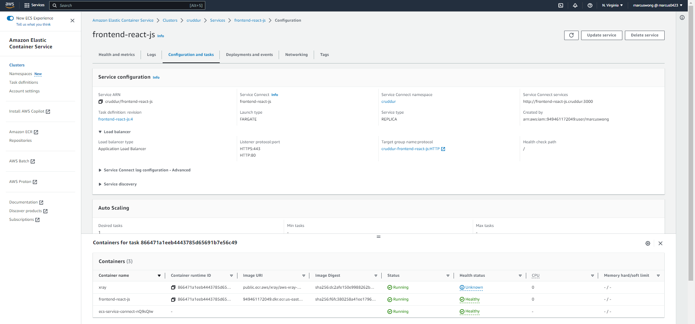
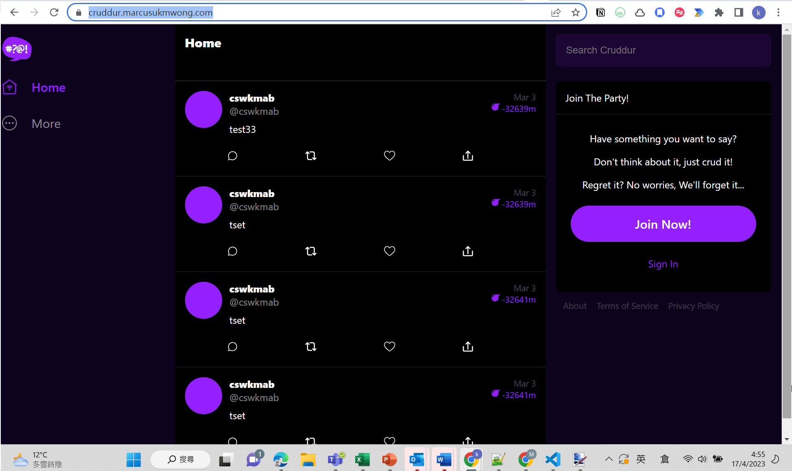

# Week 6 — Deploying Containers

- It's the first time it tried deploying container over fargate. The implementation is not difficult, most of the time is spent on implementing the bash script and following andrew's flow to debug issues in the video. 

-Below are some screen caps for the FE and BE deployment, and the screen cap for accessing the app through my own domain

Frontend deployed

Backend deployed

Accessing the deployed App through my domain
