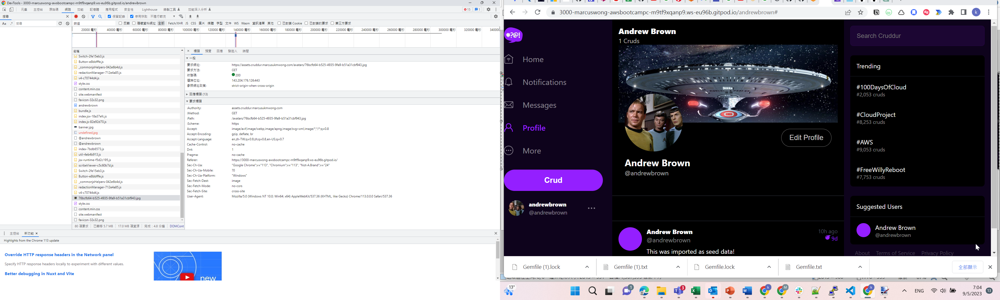

# Week 8 — Serverless Image Processing
Followed along to 
- create the buckets and policy using cdk
- served avatar through cloudfront
- implement user form , presigned url, jwt lambda function to render avatars in App

